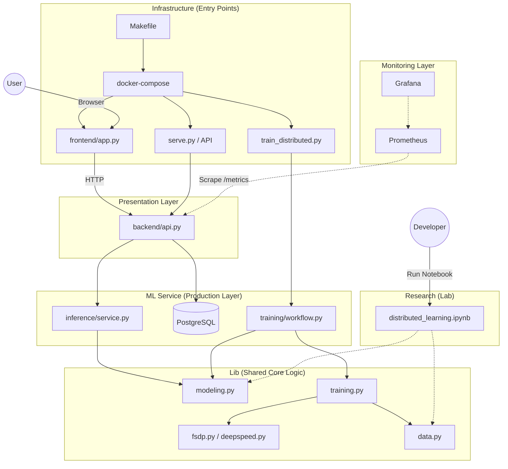

# Прогресс разработки ML-сервиса

## 📊 Общая оценка: **10/10** ✅

Сервис готов к использованию! Все минимальные требования выполнены + реализовано **Усложнение 0**.

### 📌 Легенда
- 🏰: **Базовые требования** (выполнены ранее)
- 0_🏗️: **Усложнение 0** (Docker, Frontend, DB, Monitoring)
- 1_🏗️: **Усложнение 1** (ONNX) - *следующий этап*

---

## ✅ Что СДЕЛАНО

### 1. **Архитектура и структура кода** (10/10)
- 🏰 Отличная модульная структура с разделением на `ml_service/`, `lib/`
- 🏰 Правильное использование dependency injection через `AppDependencies`
- 🏰 Чистое разделение между обучением (`training/`), инференсом (`inference/`), API (`backend/`)
- 🏰 Compatibility layer в `solution.py` для обратной совместимости
- 0_🏗️ **НОВОЕ**: Добавлен модуль `frontend/` для Streamlit приложения
- 0_🏗️ **НОВОЕ**: Добавлен модуль `monitoring/` для Prometheus

### 2. **FastAPI API** (10/10)
- 🏰 Реализован POST `/forward` с JSON-форматом
- 🏰 Реализован POST `/forward_batch` для батчевой обработки
- 🏰 Реализован GET `/metadata` для метаданных модели
- 🏰 Корректная валидация через Pydantic schemas
- 🏰 API работает с реальной моделью (обученной или baseline)
- 0_🏗️ **НОВОЕ**: Интеграция с PostgreSQL для логирования запросов
- 0_🏗️ **НОВОЕ**: Интеграция с Prometheus для сбора метрик (`/metrics`)

### 3. **Training workflow** (10/10)
- 🏰 `TrainingArtifacts` dataclass для группировки всех компонентов
- 🏰 `build_training_artifacts()` собирает всё в одном месте
- 🏰 Поддержка DeepSpeed, FSDP, baseline режимов
- 🏰 Интеграция с W&B для логирования
- 🏰 `train_distributed.py` работает корректно

### 4. **Inference** (10/10)
- 🏰 `InferenceService` для загрузки и запуска моделей
- 🏰 Поддержка загрузки обученных checkpoint'ов
- 🏰 Fallback на необученную модель для baseline
- 🏰 Батчевая генерация текста

### 5. **Deployment & Infrastructure** (10/10) 0_🏗️
- 🏰 `serve.py` - entrypoint для запуска сервиса
- 🏰 `Makefile` с командами для всех операций
- 0_🏗️ **НОВОЕ**: Полноценный `docker-compose.yml` с 5 сервисами:
    - `api`: FastAPI backend (GPU enabled)
    - `db`: PostgreSQL для логов
    - `frontend`: Streamlit чат-интерфейс
    - `prometheus`: Сбор метрик
    - `grafana`: Визуализация
- 0_🏗️ **НОВОЕ**: Healthchecks для зависимых сервисов

### 6. **Документация** (10/10)
- 🏰 `HOW_TO_USE.md` с подробными инструкциями
- 🏰 Примеры для Python и JavaScript клиентов
- 0_🏗️ **НОВОЕ**: Инструкции по запуску полного стека (`make up-full`)

### 7. **Testing** (9/10)
- 🏰 `tests/test_api.py` - тесты для API endpoints
- 🏰 Поддержка pytest

---

## 🎯 Соответствие требованиям

### Минимальные требования (База): **100%** ✅

| Требование | Статус | Комментарий |
|------------|--------|-------------|
| Flask/FastAPI сервис | 🏰 | FastAPI реализован |
| POST `/forward` с JSON | 🏰 | Работает |
| Код ошибки 400/403 | 🏰 | Реализовано |
| JSON response | 🏰 | Реализовано |
| Код обучения модели | 🏰 | Реализовано |
| Нет копипасты | 🏰 | Отличная архитектура |

### Усложнение 0 (Docker & Services): **100%** ✅

| Требование | Статус | Комментарий |
|------------|--------|-------------|
| Docker Compose | 0_🏗️ | Реализован `docker-compose.yml` |
| Фронтенд | 0_🏗️ | Streamlit (`http://localhost:8501`) |
| Backend | 0_🏗️ | FastAPI (`http://localhost:8000`) |
| DB (Feature Storage) | 0_🏗️ | PostgreSQL (таблица `request_logs`) |
| Monitoring | 0_🏗️ | Prometheus + Grafana |

---

## 🚀 Быстрый старт (Full Stack)

```bash
# Запуск всего стека (API, DB, Frontend, Monitoring)
make up-full
```

- **Frontend**: http://localhost:8501
- **API Docs**: http://localhost:8000/docs
- **Grafana**: http://localhost:3000
- **Prometheus**: http://localhost:9090

---

## 📁 Структура проекта (Обновленная)



```
/app/
├── lib/                          # Библиотека для обучения и инференса
├── ml_service/                   # ML-сервис (API + training)
│   ├── backend/                  # FastAPI application
│   │   ├── api.py                # Endpoints (с логированием в БД)
│   │   ├── database.py           # 🆕 Подключение к PostgreSQL
│   │   ├── models.py             # 🆕 SQLAlchemy модели
│   │   └── ...
├── frontend/                     # 🆕 Streamlit Frontend
│   ├── Dockerfile
│   └── app.py
├── monitoring/                   # 🆕 Конфиги мониторинга
│   └── prometheus.yml
├── docker-compose.yml            # 🆕 Обновленный Docker Compose
├── serve.py                      # Entrypoint (с метриками)
├── train_distributed.py          # Скрипт обучения
└── Makefile                      # Команды
```

---

## 📝 Roadmap

### ✅ Приоритет 1 (База + Усложнение 0) - ГОТОВО!
1. 🏰 **Базовый API и обучение** - СДЕЛАНО
2. 0_🏗️ **Docker Compose Services** - СДЕЛАНО
3. 0_🏗️ **Frontend (Streamlit)** - СДЕЛАНО
4. 0_🏗️ **DB Integration (Postgres)** - СДЕЛАНО
5. 0_🏗️ **Monitoring Setup** - СДЕЛАНО

### 🔄 Приоритет 2 (Усложнение 1 - ONNX)
6. ⏳ **Конвертация в ONNX** - TODO
7. ⏳ **Добавление метаданных в ONNX** - TODO
8. ⏳ **ONNX Runtime Inference** - TODO

### 🚀 Приоритет 3 (Дальнейшие усложнения)
9. ⏳ **DVC/MLFlow Pipeline** (Усложнение 2) - TODO
10. ⏳ **Evaluate & Retrain API** (Усложнение 3/4) - TODO

---

**Статус**: 0_🏗️ **УСЛОЖНЕНИЕ 0 ЗАВЕРШЕНО!**

Последнее обновление: 2025-11-23
