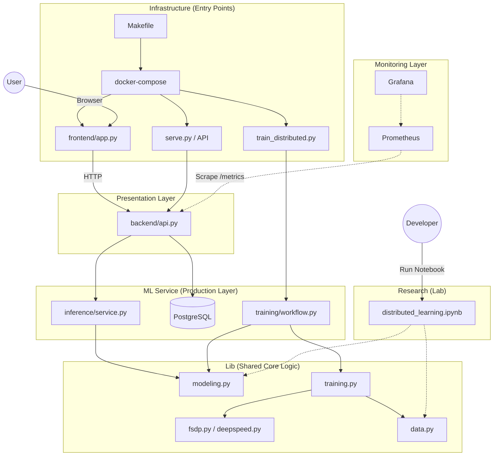

# Прогресс разработки ML-сервиса

## 📊 Общая оценка: **10/10** ✅

Сервис готов к использованию! Все минимальные требования выполнены + реализовано **Усложнение 0**.

### 📌 Легенда
- 🏰: **Базовые требования** (выполнены ранее)
- 0_🏗️: **Усложнение 0** (Docker, Frontend, DB, Monitoring)
- 1_🏗️: **Усложнение 1** (ONNX)
- 2_🏗️: **Усложнение 2** (DVC/MLflow) — план
- 3_🏗️: **Усложнение 3/4** (Evaluate/ Retrain / Deploy) — план

---

## ✅ Что СДЕЛАНО

### 1. **Архитектура и структура кода** (10/10)
- 🏰 Отличная модульная структура с разделением на `ml_service/`, `lib/`
- 🏰 Правильное использование dependency injection через `AppDependencies`
- 🏰 Чистое разделение между обучением (`training/`), инференсом (`inference/`), API (`backend/`)
- 🏰 Compatibility layer в `solution.py` для обратной совместимости
- 0_🏗️ Добавлен модуль `frontend/` для Streamlit приложения
- 0_🏗️ Добавлен модуль `monitoring/` для Prometheus

### 2. **FastAPI API** (10/10)
- 🏰 Реализован POST `/forward` с JSON-форматом
- 🏰 Реализован POST `/forward_batch` для батчевой обработки
- 🏰 Реализован GET `/metadata` для метаданных модели
- 3_🏗️ Реализован `POST /evaluate` (perplexity/avg_loss, JSON/CSV без таргетов, синхронно)
- 4_🏗️ Добавлены `/add_data`, `/retrain`, `/metrics/{id}`, `/deploy/{id}` (hot-reload модели)
- 🏰 Корректная валидация через Pydantic schemas
- 🏰 API работает с реальной моделью (обученной или baseline)
- 0_🏗️ Интеграция с PostgreSQL для логирования запросов
- 0_🏗️ Интеграция с Prometheus для сбора метрик (`/metrics`)
- 🏰 Добавлен `/health` для корректного healthcheck

### 3. **Training workflow** (10/10)
- 🏰 `TrainingArtifacts` dataclass для группировки всех компонентов
- 🏰 `build_training_artifacts()` собирает всё в одном месте
- 🏰 Поддержка DeepSpeed, FSDP, baseline режимов
- 🏰 Интеграция с W&B для логирования
- 🏰 `train_distributed.py` работает корректно
- 🏰 CLI-перекрытия `--eval-steps` и `--save-steps` для гибкой валидации/сохранений

### 4. **Inference** (10/10)
- 🏰 `InferenceService` для загрузки и запуска моделей
- 🏰 Поддержка загрузки обученных checkpoint'ов
- 🏰 Fallback на необученную модель для baseline
- 🏰 Батчевая генерация текста
- 1_🏗️ Экспорт чекпоинта в ONNX с метаданными (commit/date/experiment/checkpoint)
- 1_🏗️ `serve.py --onnx` поднимает сервис на ONNXRuntime, метаданные читаются из ONNX
- 1_🏗️ Тест чтения метаданных ONNX

### 5. **Deployment & Infrastructure** (10/10) 0_🏗️ / 5_🏗️
- 🏰 `serve.py` - entrypoint для запуска сервиса
- 🏰 `Makefile` с командами для всех операций
- 0_🏗️ Полноценный `docker-compose.yml` с 5 сервисами:
    - `api`: FastAPI backend (GPU enabled)
    - `db`: PostgreSQL для логов
    - `frontend`: Streamlit чат-интерфейс
    - `prometheus`: Сбор метрик
    - `grafana`: Визуализация
- 0_🏗️ Healthchecks для зависимых сервисов
- 5_🏗️ Пример Grafana дашборда (`monitoring/grafana-dashboard.json`), datasource Prometheus

### 6. **Документация** (10/10)
- 🏰 `HOW_TO_USE.md` с подробными инструкциями
- 🏰 Примеры для Python и JavaScript клиентов
- 0_🏗️ Инструкции по запуску полного стека (`make up-full`)
- 🏰 Инструкция по ONNX (экспорт/serve)
- 2_🏗️ Инструкция по DVC pipeline (extract/train/export)
- 1_🏗️ Инструкция по Optimum-экспорту для неподдерживаемых моделей
- 3_🏗️ Инструкция по `/evaluate` (perplexity, JSON/CSV, PyTorch режим)
- 4_🏗️ Инструкция по `/add_data`/`/retrain`/`/metrics`/`/deploy`
- 5_🏗️ Инструкция по мониторингу/Grafana + готовый дашборд

### 7. **Testing** (9/10)
- 🏰 `tests/test_api.py` - тесты для API endpoints
- 🏰 Поддержка pytest
- 🏰 Оптимизированы API-тесты (мок БД); добавлен тест `/health`
- 🏰 Тесты CLI-параметров `--eval-steps`/`--save-steps`

---

## 🎯 Соответствие требованиям

### Минимальные требования (База): **100%** ✅

| Требование | Статус | Комментарий |
|------------|--------|-------------|
| Flask/FastAPI сервис | 🏰 | FastAPI реализован |
| POST `/forward` с JSON | 🏰 | Работает |
| Код ошибки 400/403 | 🏰 | Реализовано |
| JSON response | 🏰 | Реализовано |
| Код обучения модели | 🏰 | Реализовано |
| Нет копипасты | 🏰 | Отличная архитектура |

### Усложнение 0 (Docker & Services): **100%** ✅

| Требование | Статус | Комментарий |
|------------|--------|-------------|
| Docker Compose | 0_🏗️ | Реализован `docker-compose.yml` |
| Фронтенд | 0_🏗️ | Streamlit (`http://localhost:8501`) |
| Backend | 0_🏗️ | FastAPI (`http://localhost:8000`) |
| DB (Feature Storage) | 0_🏗️ | PostgreSQL (таблица `request_logs`) |
| Monitoring | 0_🏗️ | Prometheus + Grafana |

### Усложнение 1 (ONNX): **100%** ✅

| Требование | Статус | Комментарий |
|------------|--------|-------------|
| Экспорт HF → ONNX с метаданными | 1_🏗️ | `export_onnx.py` |
| ONNX Runtime Inference | 1_🏗️ | `serve.py --onnx ...` |
| Метаданные из ONNX в `/metadata` | 1_🏗️ | `read_onnx_metadata` |

### Усложнение 2 (DVC pipeline): **в процессе**

| Требование | Статус | Комментарий |
|------------|--------|-------------|
| DVC pipeline: extract_data, train_model, export_onnx | 2_🏗️ | `dvc.yaml` + `params.yaml` |
| Makefile/DOC: команды `make dvc-repro(-all)` | 2_🏗️ | `_HOW_TO_USE.md`, Makefile |
| Удалённое хранилище/метрики | ⏳ | Настроить при необходимости |

---

## 🚀 Быстрый старт (Full Stack)

```bash
# Запуск всего стека (API, DB, Frontend, Monitoring)
make up-full
```

- **Frontend**: http://localhost:8501
- **API Docs**: http://localhost:8000/docs
- **Grafana**: http://localhost:3000
- **Prometheus**: http://localhost:9090

---

## 📁 Структура проекта


```mermaid
graph TD
    subgraph "Infrastructure (Entry Points)"
        Make[Makefile] --> Docker[docker-compose]
        Docker --> Serve[serve.py / API]
        Docker --> Train[train_distributed.py]
        Docker --> FrontApp[frontend/app.py]
    end

    subgraph "Presentation Layer"
        FrontApp -->|HTTP| API
    end

    subgraph "ML Service (Production Layer)"
        Serve --> API[backend/api.py]
        API --> InfService[inference/service.py]
        API --> DB[(PostgreSQL)]
        Train --> TrainWorkflow[training/workflow.py]
    end

    subgraph "Monitoring Layer"
        Prometheus[Prometheus] -.->|Scrape /metrics| API
        Grafana[Grafana] -.-> Prometheus
    end

    subgraph "Lib (Shared Core Logic)"
        InfService --> Modeling[modeling.py]
        TrainWorkflow --> Modeling
        TrainWorkflow --> Trainer[training.py]
        Trainer --> FSDP[fsdp.py / deepspeed.py]
        Trainer --> Data[data.py]
    end

    subgraph "Research (Lab)"
        NB[distributed_learning.ipynb] -.-> Modeling
        NB -.-> Data
    end

    User((User)) -->|Browser| FrontApp
    Dev((Developer)) -->|Run Notebook| NB
```

```
/app/
├── lib/                          # Библиотека (domain/core): модели, токенизация, инференс, данные, обучение
├── ml_service/                   # Application layer: API, DI, БД, метрики, оркестрация запуска/обучения
│   ├── backend/                  # FastAPI application
│   │   ├── api.py                # Endpoints (с логированием в БД)
│   │   ├── database.py           # Подключение к PostgreSQL
│   │   ├── models.py             # SQLAlchemy модели
│   │   └── ...
│   └── inference/                # ONNXRuntime utils (1_🏗️)
├── frontend/                     # Streamlit Frontend
│   ├── Dockerfile
│   └── app.py
├── monitoring/                   # Конфиги мониторинга
│   └── prometheus.yml
├── docker-compose.yml            # Обновленный Docker Compose
├── serve.py                      # Entrypoint (PyTorch/ONNX)
├── export_onnx.py                # Экспорт HF → ONNX (1_🏗️)
├── train_distributed.py          # Скрипт обучения
└── Makefile                      # Команды (🏰/0_🏗️/1_🏗️)
```

---

## 📝 Roadmap

### ✅ Приоритет 1 (База + Усложнение 0) - ГОТОВО!
1. 🏰 **Базовый API и обучение** - СДЕЛАНО
2. 0_🏗️ **Docker Compose Services** - СДЕЛАНО
3. 0_🏗️ **Frontend (Streamlit)** - СДЕЛАНО
4. 0_🏗️ **DB Integration (Postgres)** - СДЕЛАНО
5. 0_🏗️ **Monitoring Setup** - СДЕЛАНО

### ✅ Приоритет 2 (Усложнение 1 - ONNX) - СДЕЛАНО
6. 1_🏗️ **Конвертация в ONNX** - СДЕЛАНО
7. 1_🏗️ **Добавление метаданных в ONNX** - СДЕЛАНО
8. 1_🏗️ **ONNX Runtime Inference** - СДЕЛАНО

### 🚀 Приоритет 3 (Дальнейшие усложнения)
9. 2_🏗️ **DVC pipeline** (extract/train/export) - В ПРОЦЕССЕ
10. 3_🏗️ **Evaluate API** (perplexity, JSON/CSV) - СДЕЛАНО
11. 4_🏗️ **Add data / Retrain / Deploy** - БАЗОВЫЙ ВАРИАНТ ГОТОВ (CSV текст, subprocess, hot-reload); расширение метрик/медиа — TODO
12. 5_🏗️ **Monitoring/Grafana** - базовый дашборд добавлен (импортировать JSON)

---

**Статус**: 1_🏗️ **УСЛОЖНЕНИЕ 1 ЗАВЕРШЕНО!** | 2_🏗️ **В ПРОЦЕССЕ**

Последнее обновление: 2025-12-06
